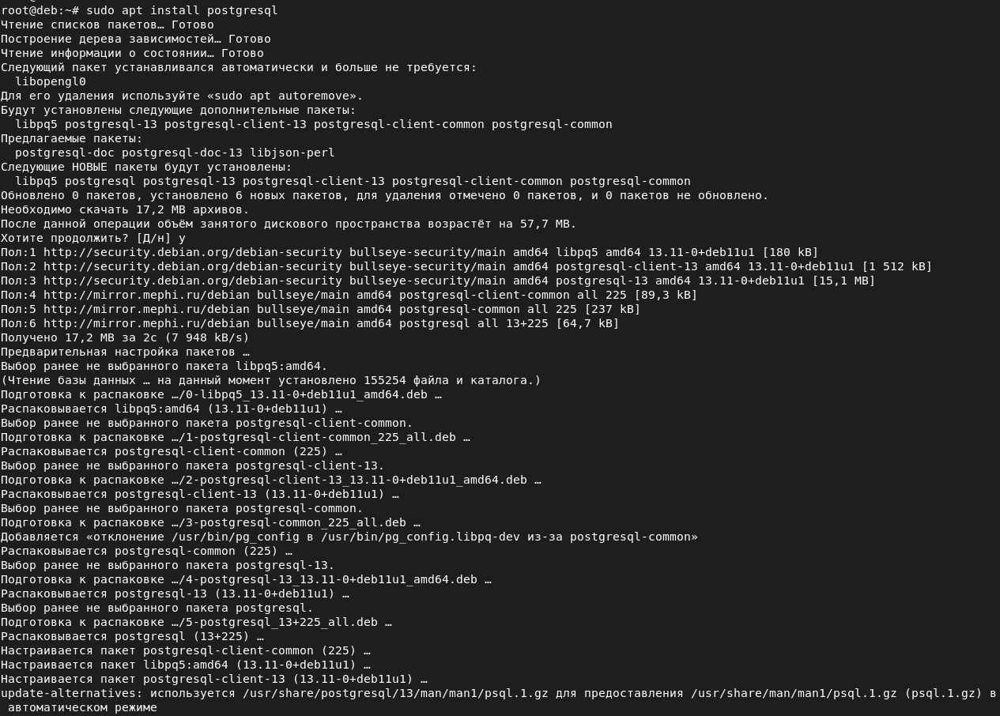
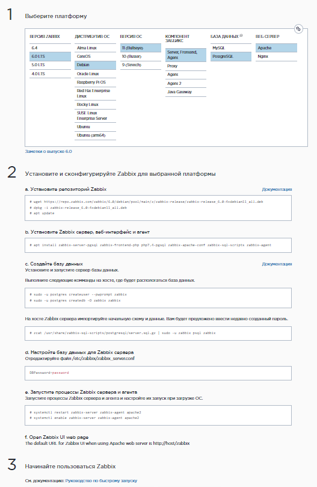
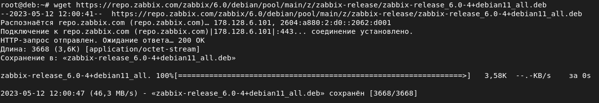
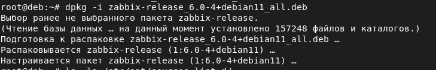
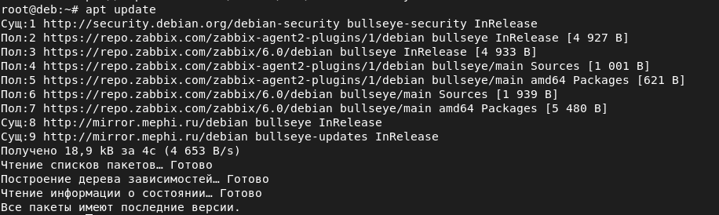
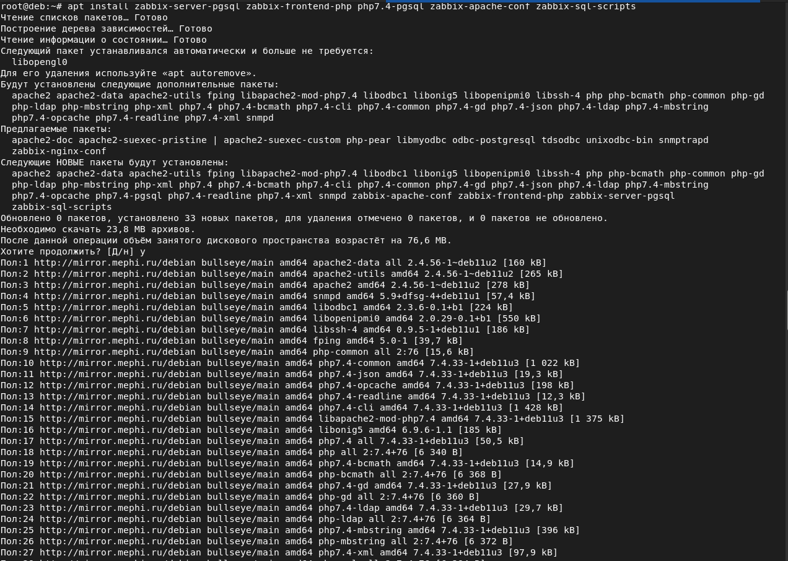
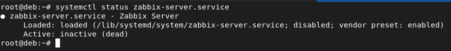
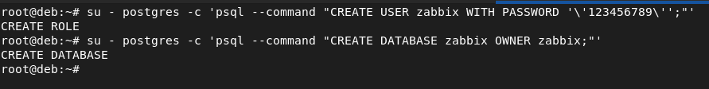
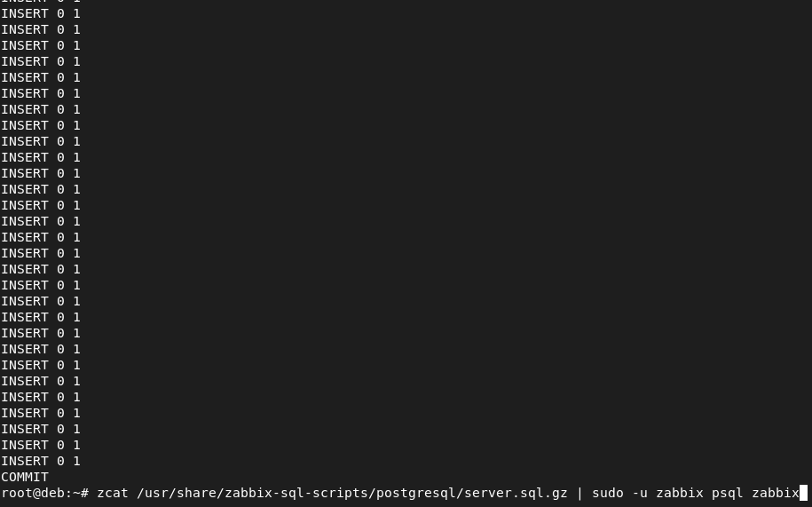
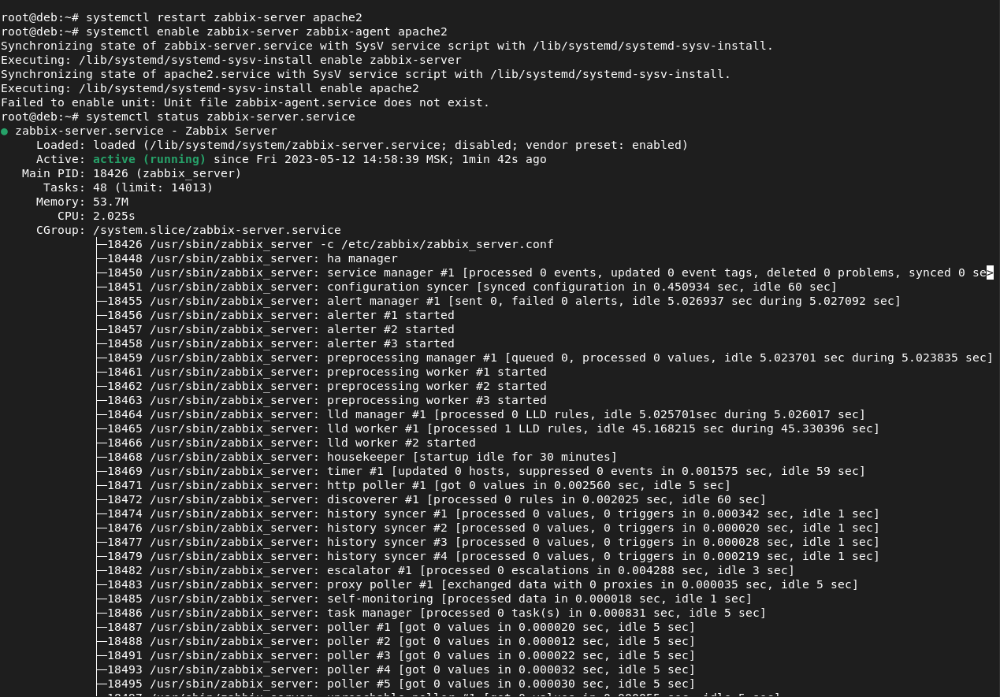

# Домашнее задание к занятию "`Система мониторинга Zabbix`" - `Колобов Михаил`
---

### Задание 1

`Приведите ответ в свободной форме........`

1. 
2. 
3. 
4. 
5. 
6. 
7. 
8. 
9. 
10. 
11. 

`Текст использованных команд`

sudo apt install postgresql

systemctl status zabbix-server.service

su - postgres -c 'psql --command "CREATE USER zabbix WITH PASSWORD '\'123456789\'';"'

su - postgres -c 'psql --command "CREATE DATABASE zabbix OWNER zabbix;"'

find / -name zabbix_agentd.conf

find / -name zabbix_server.conf

sed -i 's/# DBPassword=/DBPassword=123456789/g' /etc/zabbix/zabbix_server.conf

systemctl restart zabbix-server apache2

systemctl enable zabbix-server zabbix-agent apache2
