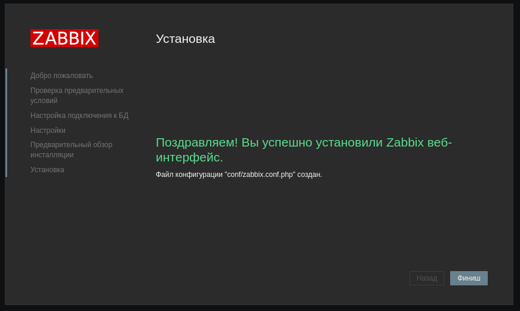

# Домашнее задание к занятию "`Система мониторинга Zabbix`" - `Колобов Михаил`

---

### Задание 1

`Приведите ответ в свободной форме........`

1. 
2. 
3. 
4. 
5. 
6. 
7. 
8. 
9. 
10. 
11. 
12. 
13. 
14. 
15. 
16. 
17. 
18. 

`Текст использованных команд`

sudo apt install postgresql

systemctl status zabbix-server.service

su - postgres -c 'psql --command "CREATE USER zabbix WITH PASSWORD '\'123456789\'';"'

su - postgres -c 'psql --command "CREATE DATABASE zabbix OWNER zabbix;"'

find / -name zabbix_agentd.conf

find / -name zabbix_server.conf

sed -i 's/# DBPassword=/DBPassword=123456789/g' /etc/zabbix/zabbix_server.conf

systemctl restart zabbix-server apache2

systemctl enable zabbix-server zabbix-agent apache2

---

### Задание 2

`Приведите ответ в свободной форме........`
1. ![02-01](screen/task_1/02-01.PNG
2. ![02-02](screen/task_1/02-02.PNG
3. ![02-03](screen/task_1/02-03.PNG
4. ![02-04](screen/task_1/02-04.PNG
5. ![02-05-01](screen/task_1/02-05-01.PNG
6. ![02-05-02](screen/task_1/02-05-02.PNG
7. ![02-06-01](screen/task_1/02-06-01.PNG
8. ![02-06-02](screen/task_1/02-06-02.PNG
9. ![02-07](screen/task_1/02-07.PNG
10. ![02-08](screen/task_1/02-08.PNG
11. ![02-09](screen/task_1/02-09.PNG
12. ![02-010](screen/task_1/02-10.PNG
13. ![02-011](screen/task_1/02-11.PNG
14. ![02-012](screen/task_1/02-12.PNG
15. ![02-013](screen/task_1/02-13.PNG
16. ![02-014](screen/task_1/02-14.PNG

`Текст использованных команд`
 wget https://repo.zabbix.com/zabbix/6.0/debian/pool/main/z/zabbix-release/zabbix-release_6.0-4+debian11_all.deb
 dpkg -i zabbix-release_6.0-4+debian11_all.deb
 apt update
 apt install zabbix-agent
 systemctl restart zabbix-agent
 systemctl enable zabbix-agent
 systemctl status zabbix-agent.service
 find / -name zabbix_agentd.log
 tail -f /var/log/zabbix/zabbix_agentd.log
 find / -name zabbix_agentd.conf
 nano /etc/zabbix/zabbix_agentd.conf
 systemctl restart zabbix-agent.service
 systemctl status zabbix-agent.service

